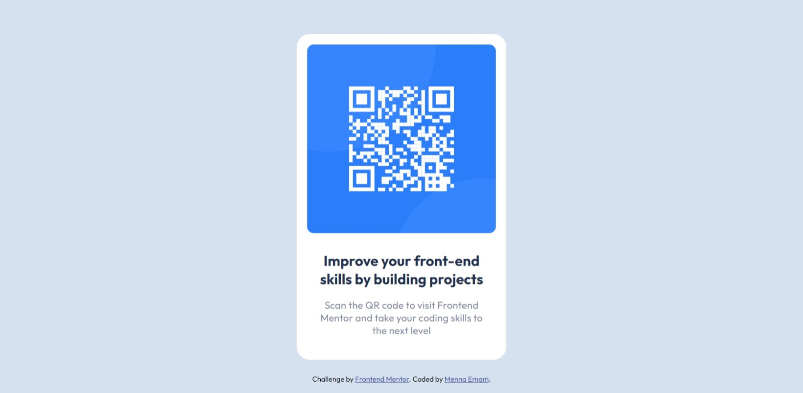

# Frontend Mentor - QR code component solution

This is a solution to the [QR code component challenge on Frontend Mentor](https://www.frontendmentor.io/challenges/qr-code-component-iux_sIO_H).

## Table of contents

- [Screenshot](#screenshot)
- [Links](#links)
- [Useful resources](#useful-resources)
- [Author](#author)

### Screenshot

### Links

- Live Site URL: 

### Useful resources

- [resource 1](https://www.freecodecamp.org/news/html-page-width-height/) - This helped me to know the best practice to set the body to take the full height.
- [resource 2](https://css-tricks.com/snippets/css/a-guide-to-flexbox/) - It contians a cheet sheet for all flexbox attributes
- [resource 3](https://blog.hubspot.com/website/center-div-css#center-div-horizontally-vertically) - This helped to know how to center elements horizontally or vertically or both 

## Author
- Frontend Mentor - [@menna601](https://www.frontendmentor.io/profile/menna601)
